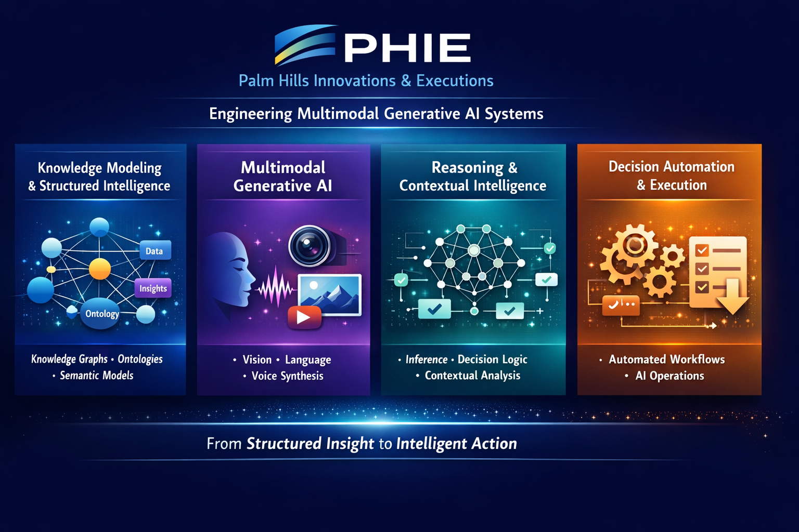
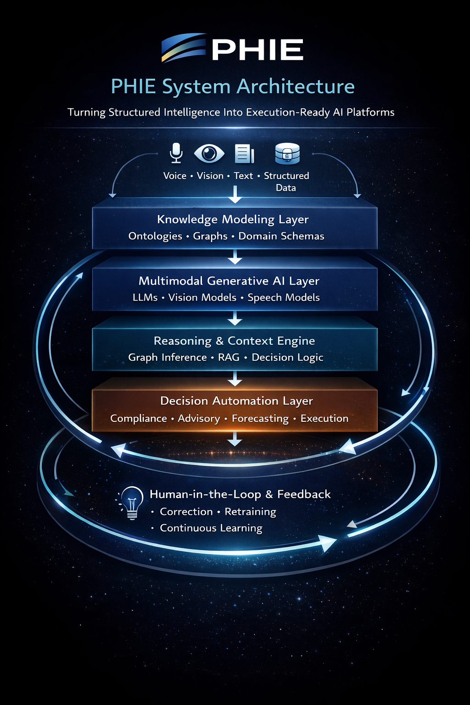

# PHIE — Palm Hills Innovations & Executions

> Turning structured intelligence into execution-ready AI platforms across industries.  
> Engineering scalable **Multimodal Generative AI systems** grounded in knowledge modeling, reasoning, and decision automation.

---

## Our Architectural Pillars

PHIE builds applied AI systems across four foundational pillars:

### 1. Knowledge Modeling & Structured Intelligence
Ontologies, knowledge graphs, semantic schemas, and domain-aware data modeling form the structural backbone of our systems.

### 2. Multimodal Generative AI
Voice, vision, language, and structured data unified through grounded generative architectures with human-in-the-loop workflows.

### 3. Reasoning & Contextual Intelligence
Graph inference, retrieval-augmented generation (RAG), contextual decision logic, and domain-aware reasoning engines.

### 4. Decision Automation & Execution Systems
Compliance engines, forecasting pipelines, advisory orchestration, and execution-ready AI operations.

---

## PHIE System Architecture

Our systems follow a layered intelligence model:

**Multimodal Inputs**  
Voice • Vision • Text • Structured Data  

↓  

**Knowledge Modeling Layer**  
Ontologies • Graphs • Domain Schemas  

↓  

**Multimodal Generative AI Layer**  
LLMs • Vision Models • Speech Models  

↓  

**Reasoning & Context Engine**  
Graph Inference • RAG • Decision Logic  

↓  

**Decision Automation Layer**  
Compliance • Advisory • Forecasting • Execution  

↺  

**Human-in-the-Loop Feedback**  
Correction • Retraining • Continuous Learning  

---

## Focus Areas

- Industrial Intelligence Systems (Topology & Graph-Based Modeling)
- AI-Driven Financial Advisory Platforms
- Deep Learning Forecasting Infrastructure
- Voice-Enabled Clinical Interaction Systems
- Knowledge-Grounded Generative AI Platforms

---

## Philosophy

We do not build isolated models.

We engineer **intelligent systems**.

Every PHIE platform is:
- Structured
- Grounded
- Explainable
- Execution-oriented
- Continuously improving

From structured insight to intelligent action.
